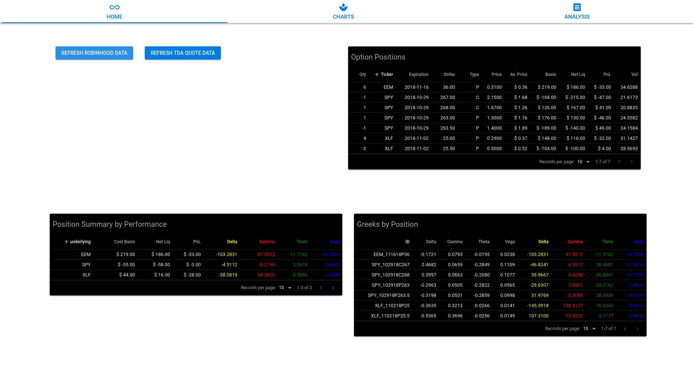

# Robinhood Options Dashboard

Dashboard for monitoring Robinhood account options positions.



## Built With

- [Quasar Framework](https://quasar-framework.org/)
- [Vuex](https://vuex.vuejs.org/)
- [Robinhood API](https://robinhood.com/)
- [TD Ameritrade API](https://developer.tdameritrade.com)

## Features

- Query current Robinhood account options positions
- Greeks calculation by position (position delta, etc.)
- Aggregated greek calculations by underlying (ie for spreads)

## Planned Enhancements

- Order Entry and submission capabilities
- Position analysis for date, volatility changes, price changes, etc. (similar to what you find in ThinkorSwim)

## Configuration

- Make a copy of the `config.example.js` file and rename to `config.js`
- Replace fields with your Robinhood account info.
- Install an 'allow CORS' extension for browser and add 'https://api.robinhood.com' to exposed header

## Getting Started

```sh
npm install -g quasar-cli@latest vue-cli@latest
npm install
quasar dev
```

## Building

Project can be built as an SPA, PWA, SSR-enabled, or electron app. [Quasar Docs](https://quasar-framework.org/)

```sh
quasar build
```

## Disclaimers

### Robinhood

- If you think the trades you make are truly free you are wrong. [Nothing is Free.](https://www.ryanhendricks.me/nothing-free/)
- Only recently has this idea become more mainstream. Personally, I've been trying to bring it to light for several years now.
- [The Exploitation of Retail Investors](https://www.ryanhendricks.me/retail-investors-exploited/)
- [Reg NMS, PFOF, and Hidden Trading Commissions](https://www.ryanhendricks.me/reg-nms-lesser-known-rules/)

Sadly, at the end of the day, the zero-commission but questionable execution wins over the paid-commission and still probably questionable execution.
Realistically though, I am looking at level 2 depth elsewhere even when placing trades via Robinhood. Furthermore, I leg into spreads rather than buy or sell them outright, which I imagine would be a world of bad price executions.

### Options Trading

- Do yourself a favor and only trade options with money you are fine with losing unless you know what you are doing. If your puts lose value after an earnings release and you don't know why then you don't know what you are doing. If you buy naked calls instead of selling put credit spreads after a selloff then you probably don't know what you are doing. If you have never found yourself trying to sell an option that no longer had a single buyer then you might know what you are doing or have only been doing this for a week. If you can't sell your position given restrictions such as the PDT rule and lose money because you don't know how to convert to a vertical and/or butterfly (delta neutral) then, again, you probably don't know what you are doing.
  
- Options are different than stocks. You buy some shares of stock and the price goes up = you make money. You buy an option and the price goes up = you make money AND someone else loses money. Options are zero-sum game and believe it or not most of the trades you place will be against people (or machines) that are smarter, faster, more knowledgeable, more capitalized, more risk-tolerant, than you could ever hope to be.

## Contributing

There is plenty more I would do to improve this project given infinite time thus any improvements you might see fit are gratefully welcomed.

1. Fork it (<https://github.com/yourname/yourproject/fork>)
2. Create your feature branch (`git checkout -b feature/fooBar`)
3. Commit your changes (`git commit -am 'Add some fooBar'`)
4. Push to the branch (`git push origin feature/fooBar`)
5. Create a new Pull Request
